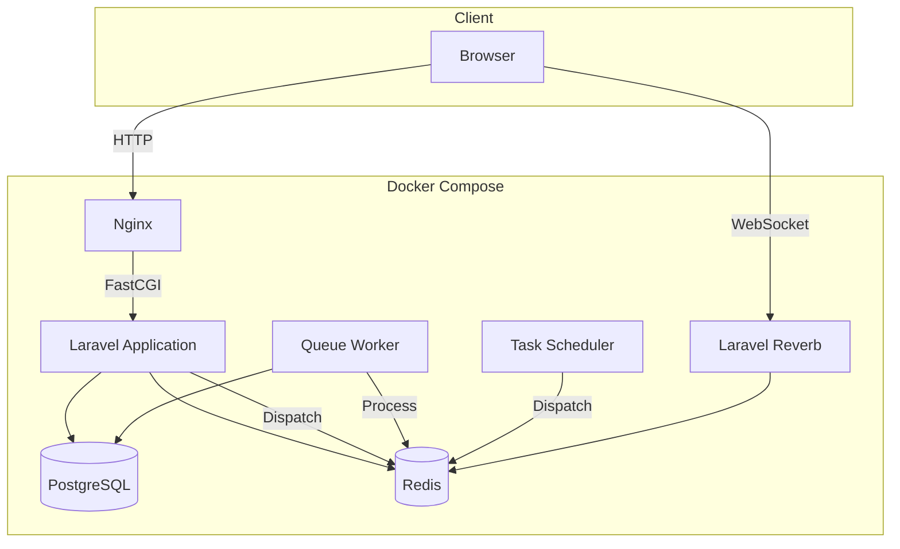
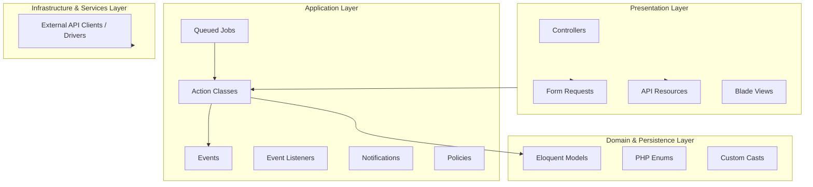
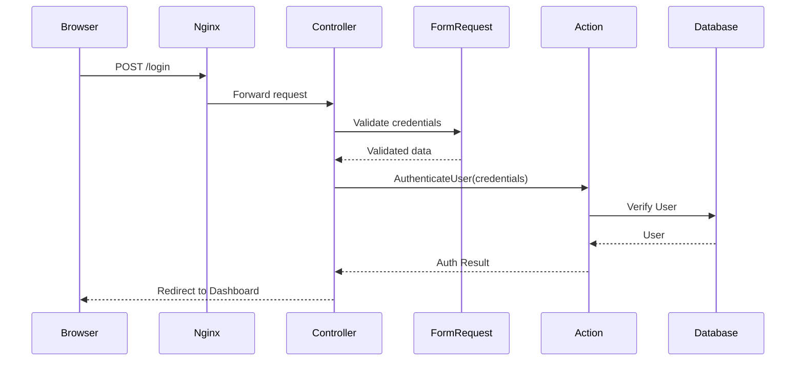
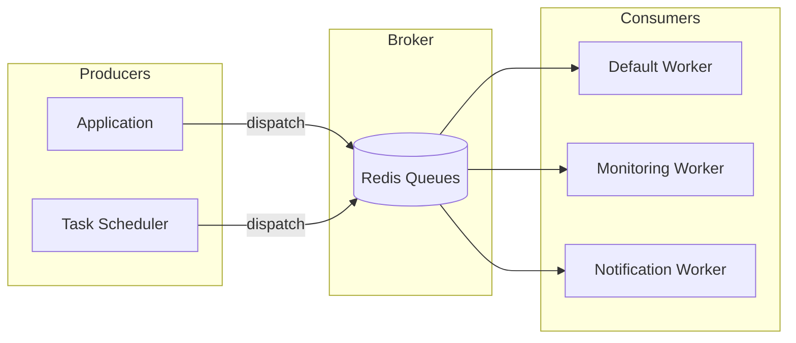
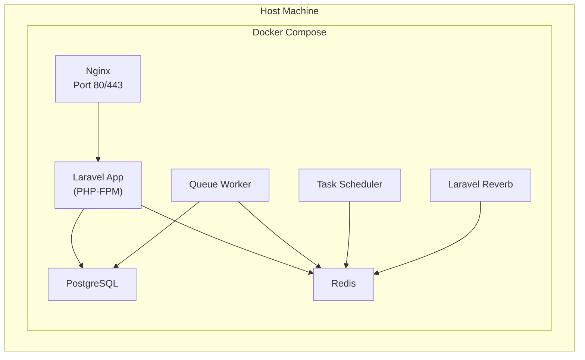

# Architecture

> This document explains **how** oblok is built and **why** each architectural decision was made.
>
> For what oblok builds, see [spec.md](spec.md). For technology rationale, see [tech-stack.md](tech-stack.md). For engineering process, see [development.md](development.md).

---

## High-Level Architecture

oblok is a monolithic Laravel application deployed via Docker Compose. The monolith uses an **Action-Driven Architecture** built on standard Laravel conventions.



**Why a monolith?**

oblok is built for self-hosted deployments. A monolith provides:

- Simpler deployment (one application, one Docker Compose topology).
- Easier debugging (single process, shared memory, no network boundaries between microservices).
- Lower operational overhead (no service mesh, no inter-service authentication).
- Faster development velocity with native Laravel tooling.

---

## Action-Driven Laravel Architecture

oblok follows idiomatic Laravel conventions enhanced by single-purpose **Action Classes** for business use cases.



### Layer Responsibilities

**Presentation Layer**
- **Controllers**: Thin orchestration controllers. They receive requests, delegate to Actions or Models, and return API Resources or Blade Views.
- **Form Requests**: Validate input and enforce authorization rules prior to controller execution.
- **API Resources**: Format models and responses into standardized JSON envelopes.
- **Blade Views**: Render HTML interface.

**Application Layer**
- **Actions**: Discrete, single-purpose classes (e.g., `CreateProject`, `ExecuteHealthCheck`). Invokable from Controllers, Jobs, CLI, or Tests.
- **Jobs**: Queued async tasks (`ProcessHealthCheckPingJob`).
- **Events & Listeners**: Decoupled domain notifications (e.g., `ServiceStatusChanged`).
- **Policies**: Fine-grained resource authorization.

**Domain & Persistence Layer**
- **Eloquent Models**: Rich Active Record entities handling relationships, casting, model scopes (`scopeActive()`), and domain query methods.
- **Enums**: Strongly typed domain values (`ServiceStatus`, `CheckType`).

**Infrastructure & Services Layer**
- **Services / Drivers**: Used strictly when interfacing with external third-party APIs (GitHub, Slack) or when polymorphic drivers exist (e.g., `HealthCheckerInterface` implemented by `HttpHealthChecker` and `PingHealthChecker`).

---

## Directory Structure

```
oblok/
├── app/                  # Single-purpose business actions & domain logic
│   ├── Actions/          # Actions (Auth, Projects, Monitoring)
│   ├── Enums/            # Typed Domain Enums
│   ├── Events/           # Domain & System Events
│   ├── Http/
│   │   ├── Controllers/  # Thin Controllers
│   │   ├── Requests/     # Input Validation
│   │   └── Resources/    # Response Envelopes
│   ├── Jobs/             # Async Background Workloads
│   ├── Listeners/        # Event Listeners
│   ├── Models/           # Rich Eloquent Domain Models
│   ├── Notifications/    # User & System Alerts
│   ├── Policies/         # Authorization Policies
│   └── Services/         # External Drivers & API Clients
├── config/               # Application Configuration
├── database/             # Migrations, Seeders, Factories
├── docker/               # Docker Nginx & PHP Container Config
├── docs/                 # System Documentation
├── resources/            # Views (Blade), CSS (Tailwind), JS (Alpine)
├── routes/               # Route Definitions (web.php, api.php, auth.php)
├── storage/              # File Storage & Logs
├── tests/                # Pest Test Suite (Feature & Unit)
├── composer.json
├── docker-compose.yml    # Root Container Orchestration
├── phpstan.neon          # Larastan Static Analysis Config
└── README.md
```

---

## Authentication Flow



Web authentication uses session-based authentication via **Laravel Breeze**.

---

## Queue Architecture



**Named Queues:**
- `default`: Standard application jobs
- `monitoring`: High-priority health check execution
- `notifications`: Alert delivery
- `low`: Maintenance and analytics cleanup

---

## API Architecture

APIs are versioned via URL prefix (`/api/v1/`).

### Standard Response Format
```json
{
  "data": {},
  "meta": {
    "pagination": {
      "current_page": 1,
      "per_page": 25,
      "total": 100,
      "last_page": 4
    }
  }
}
```

---

## Deployment Topology


