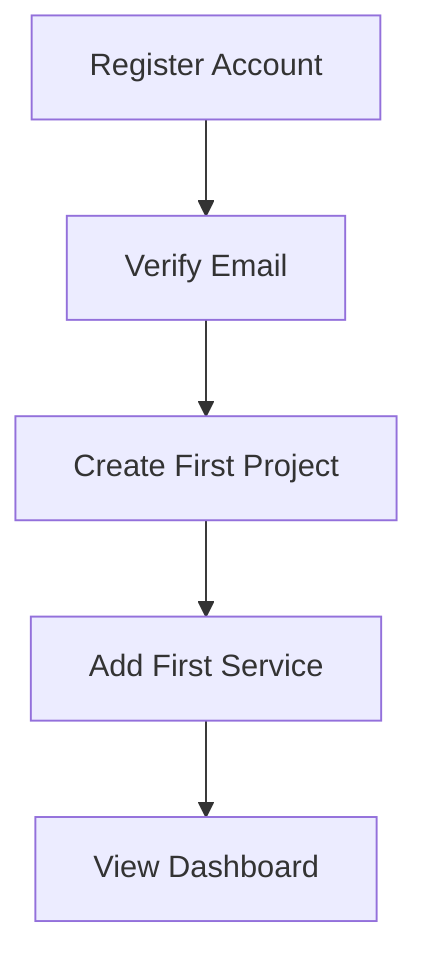
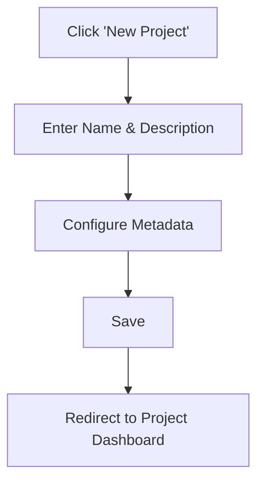
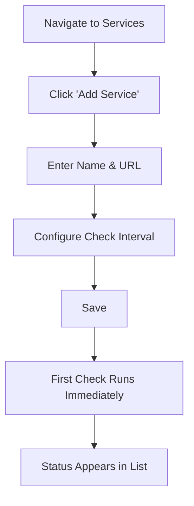
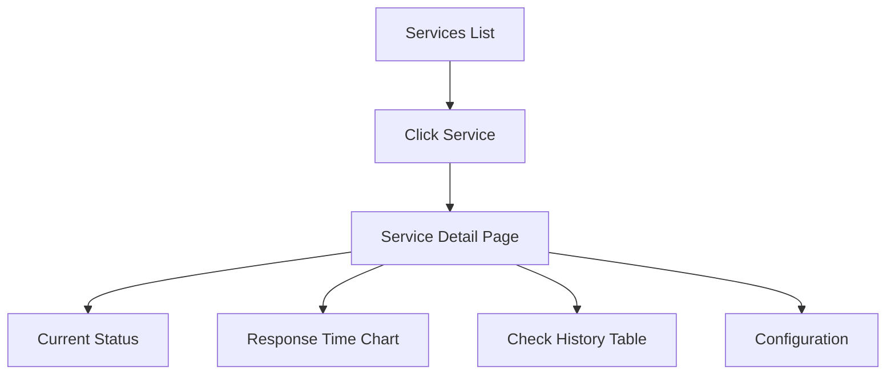

# UX Design

> User experience patterns, layouts, interaction design, and user flows for Project oblok.
>
> This document defines **how users interact** with oblok. It is distinct from [DESIGN.md](../DESIGN.md), which defines the visual design system (tokens, components, colors, typography).
>
> For product requirements, see [spec.md](spec.md). For architecture, see [architecture.md](architecture.md).

---

## Relationship to DESIGN.md

| Document | Responsibility |
|----------|---------------|
| [DESIGN.md](../DESIGN.md) | Visual language — colors, typography, spacing, component specs |
| This document | UX patterns — layouts, navigation, user flows, interaction behavior |

DESIGN.md answers "what does it look like?" This document answers "how does it work?"

---

## Navigation

### Sidebar Navigation

oblok uses a persistent left sidebar as the primary navigation mechanism.

**Structure:**

```
┌─────────────────────────────────────────────┐
│ Logo          Project Selector     User Menu │
├──────────┬──────────────────────────────────┤
│          │                                  │
│ Sidebar  │       Main Content               │
│          │                                  │
│ ─ Dashboard                                 │
│ ─ Services                                  │
│ ─ Monitoring                                │
│ ─ Logs       (future)                       │
│ ─ Queues     (future)                       │
│ ─ Deploys    (future)                       │
│ ─ Webhooks   (future)                       │
│ ─ Settings                                  │
│          │                                  │
│          │                                  │
└──────────┴──────────────────────────────────┘
```

**Behavior:**

- The sidebar is always visible on desktop.
- Active page is highlighted with a visual indicator (left border accent or background change).
- Sidebar supports collapsing to icon-only mode. Collapsed state persists across sessions.
- Navigation items show a tooltip with the label when the sidebar is collapsed.
- Keyboard shortcut to toggle sidebar: `[` (bracket key).

**Why a sidebar?** Developer tools require persistent navigation. Users frequently switch between sections (Dashboard → Services → Logs). A sidebar provides constant access without requiring the user to scroll or open a menu.

### Top Bar

The top bar contains:

- Project selector (dropdown to switch between projects).
- Breadcrumbs showing current location.
- Search trigger (opens command palette).
- Notification bell (future).
- User avatar and dropdown menu.

**Why a project selector in the top bar?** Engineers often manage multiple projects. The project context should be switchable without navigating away from the current section.

### Command Palette (Future)

Planned for v1.x. Triggered by `⌘K` / `Ctrl+K`.

- Search across projects, services, and settings.
- Navigate to any page.
- Execute common actions (create project, add service).

---

## Dashboard Layout

### Philosophy

The dashboard is the first thing a user sees after selecting a project. It must answer three questions within 5 seconds:

1. **Is everything healthy?** — Status summary at the top.
2. **What changed recently?** — Activity feed.
3. **What needs attention?** — Issues or degraded services.

### Layout

```
┌──────────────────────────────────────────────┐
│  Project Name              [Actions ▼]       │
├──────────┬──────────┬──────────┬────────────┤
│ Services │ Uptime   │ Checks   │ Incidents  │
│ 12 total │ 99.4%    │ 1,240    │ 2 open     │
├──────────┴──────────┴──────────┴────────────┤
│                                              │
│  Uptime Chart (24h / 7d / 30d)              │
│                                              │
├──────────────────────┬───────────────────────┤
│                      │                       │
│  Services List       │  Recent Activity      │
│  (status, name,      │  (timeline of events) │
│   last check)        │                       │
│                      │                       │
└──────────────────────┴───────────────────────┘
```

**Summary cards** sit at the top and provide at-a-glance metrics. Each card is clickable and navigates to the relevant detail page.

**The chart** defaults to 24-hour view. Time range is selectable. The chart shows uptime across all services in the project.

**The services list** shows all monitored services with their current status. Sorted by status (unhealthy first) then by name.

**The activity feed** shows recent events: status changes, deployments, configuration changes. Newest first.

**Why this layout?** Engineers diagnosing an issue scan top-to-bottom. The most critical information (overall health) is at the top. Detailed information (individual services, event timeline) is below. This mirrors how incident response naturally works: check status → identify the affected service → review what changed.

---

## Sidebar Behavior

### States

| State | Behavior |
|-------|----------|
| Expanded | Full labels and icons visible. Default on desktop. |
| Collapsed | Icon-only. Hover shows tooltip with label. |
| Hidden | Off-screen. Used on mobile. Triggered by hamburger menu. |

### Sections

Navigation items are grouped by function:

| Group | Items |
|-------|-------|
| Core | Dashboard, Services |
| Observability | Monitoring, Logs (future), Queues (future) |
| Operations | Deployments (future), Webhooks (future), Scheduler (future) |
| Management | Settings, API Keys (future) |

Sections have subtle dividers. Group labels are visible in expanded mode only.

**Future modules** appear in the sidebar only when the feature is enabled. Disabled modules are not shown — the sidebar does not display "coming soon" placeholders.

---

## User Flows

### Onboarding (First-Time User)



After registration, the user lands on an empty state that guides them to create their first project. After creating a project, the empty dashboard guides them to add their first service.

**Design principle:** Never show a blank screen. Every empty state provides a clear next action.

### Project Creation



Project creation is a single-page form. No wizard. No multi-step process. The minimum required field is the project name. All other fields are optional.

**Why no wizard?** Wizards add friction. Engineers want to create a project and start working. Metadata can be added later through settings.

### Adding a Service for Monitoring



The form pre-fills sensible defaults (check interval: 60 seconds, timeout: 10 seconds). The first health check runs immediately after saving so the user sees a result without waiting.

### Viewing Service Status



The service detail page provides a complete view: current status, historical performance, and configuration — all on one page without tabs.

---

## Log Inspector & HTTP Request Logs View

```
┌─────────────────────────────────────────────────────────────┐
│ Log Stream — SignalStack              [Live: ON] [API Info] │
├─────────────────────────────────────────────────────────────┤
│ [Search request or URL...]  [Status: All ▼] [Method: All ▼] │
├──────┬────────┬────────┬──────────────────────────┬─────────┤
│ Time │ Status │ Method │ URL / Message            │ Latency │
├──────┼────────┼────────┼──────────────────────────┼─────────┤
│ 19:17│  200   │  GET   │ https://example.com/api  │  42ms   │
│ 19:17│  404   │  POST  │ https://example.com/test │  12ms   │
└──────┴────────┴────────┴──────────────────────────┴─────────┘
```

- **Dual View**: Supports both raw application logs (`app.log`) and structured HTTP request logs (method, status badge, endpoint URL, user agent, latency).
- **Realtime Stream**: Toggleable auto-refresh interval for live traffic monitoring.
- **Filters**: Filter by HTTP Status Code (`2xx`, `4xx`, `5xx`), HTTP Method (`GET`, `POST`, `PUT`, `DELETE`), or string query.

---

## Empty States

Every view that can be empty must provide:

1. An icon or illustration (using Lucide icons from the design system).
2. A short, helpful message explaining what this page will contain.
3. A primary action button to create the first resource.

### Examples

| Page | Message | Action |
|------|---------|--------|
| Projects (no projects) | "No projects yet. Create one to start monitoring your services." | "Create Project" |
| Services (no services) | "No services monitored. Add a service to start tracking its health." | "Add Service" |
| Dashboard (no data) | "Waiting for data. Health checks will appear here after the first check completes." | — (automatic) |
| Activity Feed (no events) | "No activity yet. Events will appear here as your services are monitored." | — |

**Why this pattern?** Empty pages without guidance cause confusion. Users should never wonder "what do I do here?" A clear message and action button reduces time-to-first-value.

---

## Search

### Current (MVP)

- Page-level search on list views (projects, services).
- Filter input above tables.
- Debounced input (300ms) to avoid excessive requests.

### Future (v1.x)

- Global search via command palette (`⌘K`).
- Searches across projects, services, logs, and settings.
- Recent searches and frequently accessed items.

---

## Filtering

List views support filtering through a filter bar above the table.

**Pattern:**

```
┌────────────────────────────────────────────┐
│ [Search...] [Status ▼] [Sort ▼] [+ Filter]│
├────────────────────────────────────────────┤
│ Table rows...                              │
└────────────────────────────────────────────┘
```

**Behavior:**

- Filters are applied immediately (no "Apply" button).
- Active filters are shown as removable chips.
- Filter state is preserved in the URL query string so filtered views are shareable.
- Clearing all filters resets to the default view.

**Why URL-based filters?** Engineers share links. A link to "show me all unhealthy services" should work when opened by another team member.

---

## Tables

Tables are the primary way oblok displays collections of data. See [DESIGN.md](../DESIGN.md#tables) for visual specifications.

### Behavior

- **Sortable columns:** Click a column header to sort. Click again to reverse. Sort state is shown with an arrow indicator.
- **Sticky headers:** Headers remain visible when scrolling long tables.
- **Pagination:** Tables paginate at 25 rows by default. Page size is configurable (25, 50, 100).
- **Row actions:** Each row has an actions menu (three-dot icon) for edit, delete, and resource-specific actions.
- **Bulk actions:** Checkboxes on each row enable bulk operations (delete, export). A "Select All" checkbox in the header selects the current page.
- **Responsive overflow:** On narrow screens, tables scroll horizontally. Key columns (name, status) remain pinned.

### Row Click Behavior

Clicking a row navigates to the detail page for that resource. Action buttons within the row stop propagation to prevent unintended navigation.

---

## Mobile Behavior

oblok is desktop-first. Mobile is supported but optimized for read-only use.

| Feature | Desktop | Mobile |
|---------|---------|--------|
| Sidebar | Visible (collapsible) | Hidden (hamburger menu) |
| Tables | Full width with all columns | Horizontal scroll, key columns pinned |
| Charts | Interactive with tooltips | Tap to view values |
| Forms | Side-by-side fields | Stacked fields |
| Dashboard cards | 4-column grid | 2-column grid, then stacked |

**Why desktop-first?** oblok is an operational tool used at a workstation. Mobile support exists for on-call engineers checking status, not for performing complex configuration.

---

## Accessibility

oblok targets WCAG AA compliance. See [DESIGN.md](../DESIGN.md#accessibility) for visual accessibility standards (contrast, focus indicators).

### Interaction Accessibility

- **Keyboard navigation:** All interactive elements are reachable via Tab. Logical tab order follows visual layout.
- **Focus management:** Opening a modal moves focus into the modal. Closing a modal returns focus to the trigger element.
- **Screen readers:** All icons have `aria-label` attributes. Status indicators include text alternatives, not just color.
- **Skip links:** A hidden "Skip to main content" link appears on focus for keyboard users.
- **Reduced motion:** All animations respect `prefers-reduced-motion`. When enabled, transitions are instant.
- **Form errors:** Error messages are associated with fields via `aria-describedby`. Error state is communicated via `aria-invalid`.

---

## Interaction Patterns

### Destructive Actions

All destructive actions (delete project, remove service) require a confirmation dialog. The dialog:

- Names the resource being deleted.
- Explains the consequences.
- Uses a red "Delete" button (danger variant).
- Can be dismissed with Escape or clicking outside.

For high-impact deletions (project deletion), require typing the resource name to confirm.

### Loading States

- **Page load:** Skeleton loaders replace content areas. Layout does not shift when content loads.
- **Action submission:** Buttons show a loading spinner and become disabled. The label changes to reflect the action ("Saving...").
- **Background refresh:** Dashboard data refreshes silently. A subtle indicator (timestamp update) confirms freshness. No full-page reload.

### Toast Notifications

- Success: Green, auto-dismiss after 5 seconds.
- Error: Red, persists until dismissed.
- Warning: Amber, auto-dismiss after 8 seconds.
- Info: Blue, auto-dismiss after 5 seconds.

Toasts stack from the bottom-right. Maximum 3 visible at once.

---

## Information Density

oblok is designed for engineers who prefer data-rich interfaces.

**Principles:**

- Favor information density over whitespace.
- Show more data with less scrolling.
- Use compact spacing for tables and lists.
- Use summary cards for key metrics instead of full-width banners.
- Avoid decorative elements that consume screen real estate.

**Breakpoints:**

| Context | Density |
|---------|---------|
| Dashboard cards | Compact (minimal padding, key value only) |
| Tables | Dense (small row height, many visible rows) |
| Forms | Standard (comfortable input sizing for usability) |
| Documentation / Settings | Relaxed (readable line length, generous spacing) |

**Why high density?** oblok users are engineers who process structured data daily. They are accustomed to dense interfaces (terminal, IDE, GitHub). Sparse layouts waste screen space and increase cognitive load by spreading information across more scrollable area.

---

## Dashboard Philosophy

The dashboard is not a landing page. It is a diagnostic tool.

**Principles:**

1. **Status first.** The top of the dashboard answers "is everything OK?" before anything else.
2. **Anomalies surface automatically.** Unhealthy services sort to the top. Failing checks are highlighted. The user should not have to search for problems.
3. **Time context matters.** Every metric shows its time range. "99.9% uptime" is meaningless without knowing whether that is today, this week, or this month.
4. **Actionable over informational.** Every metric links to the detail view where the user can act on it. A number without a click-through is a missed opportunity.
5. **No vanity metrics.** Every number on the dashboard helps the user make a decision. If removing a metric would not change any behavior, it should not be on the dashboard.
